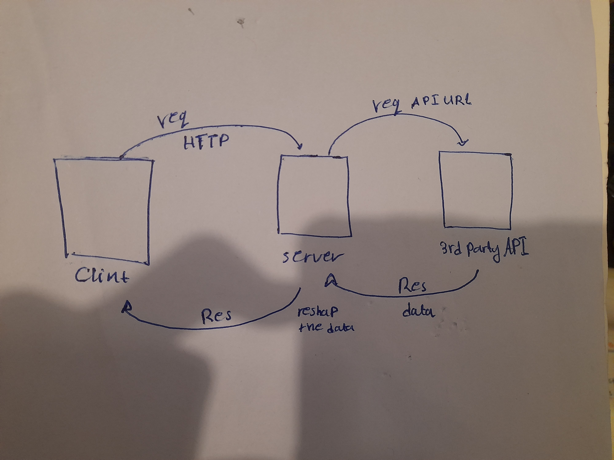

# Movies-Library - 11

**Author Name**: Maysa'a Albataineh

## WRRC

## Overview

this code creat a server by using the **express framwork** then run the server by using the **nodemon** after that check if the server is ready to working now you can send any requset you need to the server then the server send the request to the 3party API after that send the respons to the server then the server send the respons to the clint  

## Getting Started
<!-- What are the steps that a user must take in order to build this app on their own machine and get it running? -->
1-open the termenal and  put the command **npm initi -y** to installing the node  
2-installing the expres by using the command **npm install expres**  
3-installing the cors by using the command **npm i -g nodemon**  
4- installing the nodemon by using the command **npm install expres**
5- installing the axios by using the command **npm install axios**
6- installing the dotenv by using the command **npm install dotenv**
7-creat the JSON file inside the termenal or inside the VS code  (fileName.json)
7-write in the VS code :  
`const expres= requir ('expres')` to creat the server  
`const app=express()`invok the express inside the app variable
`const cors=require('cors')`
`const axios =require('axios')`to creat the promis
`require('dotenv').config();`
`const port =3002` Here specify the port number that will run the server  
`app.lesten(port,()=>{consol.log("srever is run")})`Check here if the server is running and ready to starts working
8-write the rout with method get then creat the function
app.method(endpath,handllerfunction)
function handllerfunction(req,res){
`let URL=https://api.themoviedb.org/3/trending/all/week?api_key=${apikey}&language=en-US`get the API and the API KEY
`axios.get(URL)` creat the promis using the axios
`.then((result)=>{res.json(dataMoves)})` if the server get respons show me the data in res.json
`.catch((err)=>{ res.send(err);})` if the server have any prpblem or didnot get any data show me the error meesage

    9-open the thunder clint :
    select the method what you wont |http://locallhost:#port/endpath
    click send 

## Project Features
<!-- What are the features included in you app -->
When you are send a request to the server then the server get the respons from the API after that send the respons to the clint   
