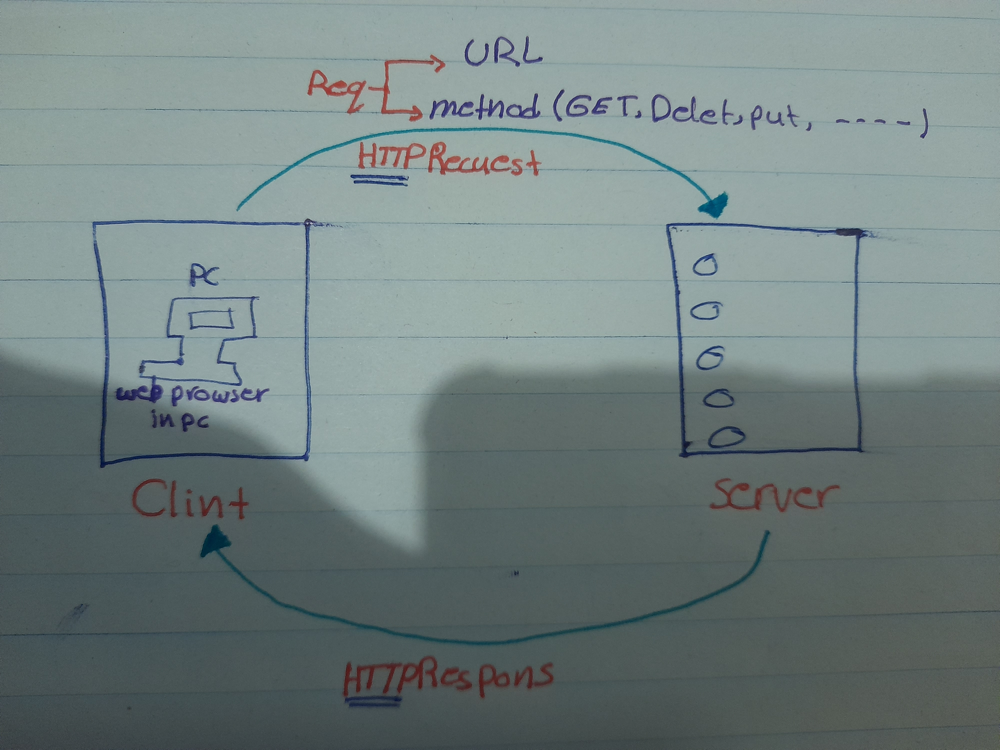

# Movies-Library - 11

**Author Name**: Maysa'a Albataineh

## WRRC

## Overview

this code creat a server by using the **express framwork** then run the server by using the **node** after that check if the server is ready to working now you can send any requset you need then the server gev you the response you need  

## Getting Started
<!-- What are the steps that a user must take in order to build this app on their own machine and get it running? -->
1-open the termenal and  put the command **npm initi -y** to installing the node  
2-installing the expres by using the command **npm install expres**  
3-creat the JSON file inside the termenal or inside the VS code  (fileName.json)
4-write in the VS code :  
`const expres= requir ('expres')` to creat the server  
`const app=express()`invok the express inside the app variable
`const port =3002` Here specify the port number that will run the server  
`app.lesten(port,()=>{consol.log("srever is run")})`Check here if the server is running and ready to starts working
5-write the method(get) what i need and what the response:
`app.method(endpath,handllerfunction)
function handllerfunction(req,res){
    res.sen("write  message")`

    //or get data from JSON data  
   res.json(name variable have the data)  
    6-in the end must check the respose if server gev me the same response i need by using **the thunder**

    7-open the thunder clint :
    select the method what you wont |http://locallhost:#port/endpath
    click send 

}

## Project Features
<!-- What are the features included in you app -->
What you are send a request you will receive the response you need  
